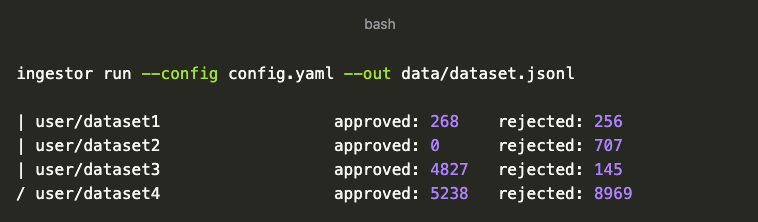
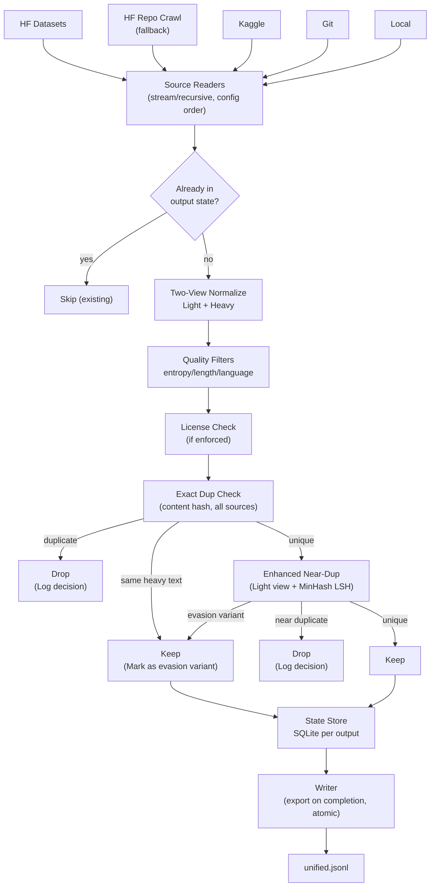

<!-- Badges -->
[](https://github.com/raaihank/ingestor/actions/workflows/build.yml)
[](https://github.com/raaihank/ingestor/actions/workflows/test.yml)
[](https://github.com/raaihank/ingestor/actions/workflows/security.yml)

# Ingestor
Fast, reproducible dataset ingestion for LLM security and general NLP. Pull from Hugging Face, Kaggle, Git, or local folders; label normalization, filter, dedupe, and write atomic JSONL.

### Use cases

- Build a unified security/classification corpus from HF/Kaggle/Git/local
- Normalize labels to a canonical set (e.g., malicious/benign)
- Enforce language and license rules
- Remove low‑quality and near‑duplicate samples
- Produce atomic JSONL for downstream training/indexing

### Install

```bash
pip install -e .[dev]
```

### Quick start (demo)

```bash
# Run test dataset normalization using local files
ingestor test

# See the output
cat test-data/unified.sample.jsonl | head -n 3
```



### Minimal YAML

```yaml
# Auth: prefer `export HF_TOKEN=hf_...`; `hf_token: "hf_..."` also works, but keep that file out of git
# Datasets (processes ALL splits by default)
hf:
  - deepset/prompt-injections  # Gets train + test + validation splits

store_raw: false
allowed_languages: [en]  # or ["*"] for all languages
language_confidence: 0.7
enforce_license: true

# Normalize labels to malicious/benign (auto-formatted to lowercase_with_underscores)
global_label_map:
  "1": malicious
  "0": benign
  malicious: malicious
  benign: benign
```

More ready-to-use configs (local files, mixed sources, license-clean, tuning): see [Config examples](#config-examples).

### Verify (dry-run)

```bash
ingestor verify --config my.config.yaml
```

Shows sample counts, label distribution, previews; fails if HF override columns are missing.

### Run

```bash
ingestor run --config my.config.yaml --out data/unified.jsonl
```

### Auth

```bash
export HF_TOKEN=hf_...       # Hugging Face (accept gated terms in web UI once)
export KAGGLE_USERNAME=...   # Kaggle
export KAGGLE_KEY=...
```

### Output

Atomic JSONL with: `id`, `source`, `source_id`, `normalized_text`, `prompt_hash`, `label`, `meta` (and optional `raw`).

`normalized_text` is the light view (NFC, lowercase, collapsed whitespace; zero-width/BiDi characters are kept). Use `--store-raw` to also keep the original text.

> **💡 Resumable Processing**: Every accepted record — and every rejection decision — is stored in a per-output SQLite state file under `.state/` (`<output-name>-<hash>.sqlite`, directory configurable with `state_dir` / `--state-dir`). The JSONL is exported from that state when a run completes. If a run is interrupted (even killed), run the same command again: items already decided are skipped and the output ends up identical to an uninterrupted run. Different `--out` paths never share state.

### Commands

- `ingestor run` — ingest sources to JSONL (flags: `--config`, `--out`, `--hf`, `--git`, `--kaggle`, `--local`, `--store-raw/--no-store-raw`, `--allowed-lang`, `--language-confidence`, `--enforce-license/--no-enforce-license`, `--hf-token`, `--kaggle-username`, `--kaggle-key`, `--io-workers`, `--cpu-workers`, `--batch-size`, `--state-dir`, `--fresh`, `--debug`). Flags override the config file; source flags add to its sources. Exits with code 1 (after writing the output) if any source failed, and 2 if no sources are configured.
- `ingestor verify` — dry‑run preview (flags: `--config`, `--per-dataset`, `--debug`); writes no state
- `ingestor test` — demo on bundled `test-data/`
- `ingestor version` — show version
 - `ingestor tune` — suggest optimal `io-workers`, `cpu-workers`, and `batch-size` (flags: `--sample`, `--top-n`, `--target-batch-bytes`, `--json`)

> **⚡ Idempotent Operations**: Re-running `ingestor run` with the same config and output produces the same file. Records are identified by `source:source_id`; items decided by an earlier run are skipped (accepted ones are reported as `existing`, rejected ones with their original reason). Sources are consumed in config order, so the output order doesn't depend on download timing. Adding a source and re-running appends its records; to rebuild after removing a source or changing filters, pass `--fresh`.

### In‑depth configuration

- Sources
  - `hf`: list of HF datasets (**all splits** ingested by default: train, test, validation, etc.). If `datasets` can't load a repo, its data files are crawled instead.
  - `kaggle`: list of Kaggle dataset refs (license read from the dataset metadata)
  - `git`: list of Git repo URLs (shallow clone; structured data files only — docs/config files are skipped; license detected from `LICENSE`/`COPYING`)
  - `local`: list of filesystem globs (supports `**` recursion)

- Overrides (per-source)
  - `*_overrides.<id>.text_column` — pick text field when auto-detect is wrong
  - `*_overrides.<id>.label_column` — pick label field
  - `*_overrides.<id>.category` — annotate category into `meta.category` (a row's own `category` column wins)
  - `*_overrides.<id>.license` — declare the license (takes precedence over what the source reports)
  - `hf_overrides.<id>.split` — use specific split only (e.g., `"train"`, `"test"`); an unknown split is an error
  - `kaggle_overrides.<id>.include_globs` / `local_overrides.<id>.include_globs` — only read matching files (Kaggle reads structured files by default; list e.g. `"*.txt"` to include text files)
  - `local_overrides` / `local_label_maps` keys are the configured glob or any path glob (e.g. `"data/security/**"`)
  - An empty entry (`owner/dataset:` with nothing below) means no overrides

- Label normalization
  - `global_label_map` maps raw → canonical (e.g., "1" → `malicious`)
  - `hf_label_maps` / `kaggle_label_maps` / `local_label_maps` override per dataset (HF keys may be `name` or `name:split`)
  - Map keys also match regardless of case/separators (`"Prompt Injection"` matches `prompt_injection`); `true`/`false` and `1.0` labels match `"true"`/`"false"` and `"1"`
  - **Automatic formatting**: All labels converted to `lowercase_with_underscores` format

- Quality thresholds
  - `min_entropy`, `min_length`, `max_length`
  - `near_duplicate_threshold`: fixed similarity threshold; leave unset for the length-aware thresholds below
  - Enhanced deduplication: `near_dup_num_perm`, `near_dup_memory_limit`, `preserve_evasion_variants`, `enable_duplicate_logging`

- Language detection
  - `allowed_languages`: list of language codes (e.g., `[en, es, fr]`) or `["*"]` for all languages
  - `language_confidence`, `fasttext_lid_path` (optional heavier model); langdetect is seeded so results are reproducible

- State
  - `state_dir` (default `.state`): where the per-output state files live

Unknown config keys are rejected, so a typo can't silently disable a setting.

### Config examples

Copy one into a file (e.g. `my.config.yaml`), check it with `ingestor verify --config my.config.yaml`, then run `ingestor run --config my.config.yaml --out data/unified.jsonl`.

- [Local files with your own columns](#local-files-with-your-own-columns)
- [Prompt-injection corpus from Hugging Face](#prompt-injection-corpus-from-hugging-face)
- [Mixing Hugging Face, Kaggle, Git and local sources](#mixing-hugging-face-kaggle-git-and-local-sources)
- [License-clean corpus](#license-clean-corpus)
- [Keep almost everything, for inspection](#keep-almost-everything-for-inspection)
- [Tuning deduplication](#tuning-deduplication)
- [Tuning speed](#tuning-speed)

> Label-map keys work with or without quotes (`1:`, `"1":`, `true:`): config keys are always read as text. Only `true`/`false` are booleans, so `yes`, `no`, `on` and `off` stay plain words (e.g. `no` for Norwegian in `allowed_languages`).

#### Local files with your own columns

Columns are auto-detected: text from `text`, `prompt`, `content`, `input`, `instruction`, `message`, `question` or `body`; label from `label`, `labels`, `target`, `class`, `category`, `injection_type`, `is_malicious`, `malicious` or `y`. Override them where your files differ.

```yaml
local:
  - "data/raw/**/*.jsonl"
  - "data/raw/**/*.csv"
  - "data/raw/support_tickets/*.parquet"

allowed_languages: [en]

local_overrides:
  # Keys are one of the globs above or any path glob
  "data/raw/support_tickets/**":
    text_column: body_text    # use this column instead of auto-detection
    label_column: is_attack   # true/false values
    category: support_tickets

global_label_map:
  true: malicious
  false: benign
  1: malicious
  0: benign
```

#### Prompt-injection corpus from Hugging Face

Hugging Face rows use the `text`, `prompt` or `content` column and the `label` column unless overridden. Gated datasets need `HF_TOKEN`.

```yaml
hf:
  - deepset/prompt-injections                      # text, label (0/1)
  - qualifire/prompt-injections-benchmark          # text, label (jailbreak/benign)
  - hackaprompt/hackaprompt-dataset                # injection attempts from the HackAPrompt competition
  - Necent/llm-jailbreak-prompt-injection-dataset  # prompt, is_dangerous (0/1)

allowed_languages: [en]
language_confidence: 0.7
min_entropy: 1.5   # short attacks have low entropy
min_length: 5
max_length: 50000

hf_overrides:
  deepset/prompt-injections:
    category: prompt_injection
  qualifire/prompt-injections-benchmark:
    category: prompt_injection
  hackaprompt/hackaprompt-dataset:
    text_column: user_input   # "prompt" is the full prompt: the level's template plus the input
    label_column: correct
    category: prompt_injection
  Necent/llm-jailbreak-prompt-injection-dataset:
    label_column: is_dangerous   # this dataset has no "label" column

global_label_map:
  1: malicious
  0: benign
  jailbreak: malicious
  benign: benign

hf_label_maps:
  hackaprompt/hackaprompt-dataset:
    # Every row is an injection attempt; "correct" only says whether it succeeded
    true: malicious
    false: malicious
```

#### Mixing Hugging Face, Kaggle, Git and local sources

Sources download in parallel and are processed in the order listed. Kaggle needs `KAGGLE_USERNAME` and `KAGGLE_KEY`.

```yaml
hf:
  - deepset/prompt-injections
  - "owner/dataset:config@v1.0"   # optional config name and revision
kaggle:
  - owner/kaggle-dataset
git:
  - https://github.com/owner/prompt-corpus.git   # structured data files only (.jsonl/.json/.csv/.tsv/.parquet/.arrow)
local:
  - "data/in-house/*.jsonl"

hf_overrides:
  "owner/dataset:config@v1.0":
    split: train            # only this split (default: all splits)
    text_column: question

kaggle_overrides:
  owner/kaggle-dataset:
    include_globs: ["**/*.csv", "*.txt"]   # only these files; .txt files become one sample each
    text_column: prompt
    label_column: class
    category: prompt_injection

global_label_map:
  1: malicious
  0: benign
```

#### License-clean corpus

With `enforce_license`, only MIT, Apache-2.0, BSD-3-Clause, CC0-1.0, CC-BY-4.0, CC-BY-SA-4.0 and Unlicense data is kept (spelling variants like `apache-2.0` or `CC0: Public Domain` are recognized); everything else is rejected with reason `license`.

```yaml
enforce_license: true

hf:
  - deepset/prompt-injections                    # license read from the dataset card (cc-by-4.0)
  - owner/dataset-without-a-card-license
git:
  - https://github.com/owner/prompt-corpus.git   # license detected from its LICENSE file
local:
  - "data/in-house/*.jsonl"

hf_overrides:
  owner/dataset-without-a-card-license:
    license: apache-2.0   # only if you checked the license yourself
local_overrides:
  "data/in-house/*.jsonl":
    license: MIT          # local files carry no license; declare it
```

#### Keep almost everything, for inspection

Turns the quality filters off to see what a source contains. Exact duplicates are still dropped.

```yaml
local:
  - "data/raw/**/*.jsonl"

store_raw: true                # keep the original text next to normalized_text
allowed_languages: ["*"]
language_confidence: 0.0       # accept any detected language
min_entropy: 0.0
min_length: 1
max_length: 1000000
near_duplicate_threshold: 1.0  # only drop texts whose MinHash signatures are identical
```

#### Tuning deduplication

Add any of these to a config. After changing them for an existing output, run once with `--fresh`: earlier decisions are otherwise kept.

```yaml
near_duplicate_threshold: 0.85    # one fixed threshold; leave unset for length-aware 0.95 / 0.91 / 0.89
near_dup_num_perm: 128            # fewer permutations: faster, slightly less precise
near_dup_memory_limit: 200000     # signatures kept in memory; the oldest are evicted
preserve_evasion_variants: false  # collapse homoglyph / zero-width / BiDi variants into one record
enable_duplicate_logging: false   # skip the duplicate_log audit table
```

#### Tuning speed

Add any of these to a config; `ingestor tune` suggests values for your machine.

```yaml
io_workers: 8                          # sources downloaded in parallel
cpu_workers: 15                        # worker processes for normalization, filters, language detection and MinHash (1 = in-process)
batch_size: 512                        # texts per worker batch
fasttext_lid_path: /models/lid.176.bin # faster language detection; default ./lid.176.bin (see `make setup-fasttext`)
state_dir: /mnt/nvme/ingestor-state    # resumable state on a fast disk
```

### Logging UX

- Default: one spinner line per active dataset, updated in place with green approved / red rejected counts
- Non‑TTY/CI: plain final lines without spinner
- `--debug`: structured debug logs to stderr as NDJSON, in addition to summaries

### Performance tuning (parallel)

- Two-stage concurrency:
  - IO threads: fetch/iterate up to `io-workers` sources in parallel (HF/Git/Kaggle/local), consumed in config order
  - CPU pool (processes): normalize → hash → entropy/length/language filters → MinHash signature, in batches
  - Main process: dedupe against the state database and store records
  - `--cpu-workers 1` runs the CPU stage in-process (no pool)
- Auto worker sizing:
  - io-workers: min(32, 4×CPU cores)
  - cpu-workers: max(1, CPU cores − 1)
- Batch size: number of items processed together (reduces overhead, speeds SQLite and file writes)
  - auto targets ~2MB per batch; adapts from a small sample
  - manual override via `--batch-size N`
- Use `ingestor tune` to see suggestions per machine; add `--sample data/unified.jsonl` for tighter batch estimates.

### Language Detection Optimization

For faster language detection, install the FastText model:

```bash
make setup-fasttext
# or
python scripts/setup_fasttext.py
```

This downloads the FastText language identification model (~125MB) which provides:
- **10-100x faster** language detection vs. langdetect fallback
- **Higher accuracy** on short texts and technical content
- **Better handling** of mixed-language content

The setup script:
- Shows download progress and verifies file integrity
- Tests model compatibility and handles NumPy version issues
- Provides clear feedback on setup status
- Supports custom model locations via `FASTTEXT_LID_PATH` environment variable

Without FastText, the system gracefully falls back to langdetect (slower but functional).

### Dataset Split Handling

**HuggingFace datasets now process ALL splits by default** (train, test, validation, etc.) instead of just the train split:

```yaml
hf:
  - "deepset/prompt-injections"  # Gets both train (546) + test (116) = 662 records
```

**To use only specific splits:**

```yaml
hf_overrides:
  "deepset/prompt-injections":
    split: "train"  # Use only train split
  "other/dataset":
    split: "test"   # Use only test split
```

### Multilingual Support

**Process datasets in any language** using the wildcard `"*"`:

```yaml
allowed_languages: ["*"]  # Accept all languages
language_confidence: 0.3  # Lower threshold for multilingual content
```

**Or specify multiple languages:**

```yaml
allowed_languages: [en, es, fr, de, zh, ja]  # English, Spanish, French, German, Chinese, Japanese
```

### Label Normalization

**All labels are automatically normalized** to a consistent format:

| Input | Output |
|-------|--------|
| `"Prompt Injection"` | `"prompt_injection"` |
| `"JAILBREAK"` | `"jailbreak"` |
| `"Safe Content"` | `"safe_content"` |
| `"benign-text"` | `"benign_text"` |

This ensures consistent labeling across all datasets and sources.

### Enhanced Deduplication System

The ingestor features a sophisticated **multi-layered deduplication system** specifically designed for attack-mitigation datasets. It preserves important evasion variants while removing true duplicates.

#### 🔧 **Two-View Normalization**

The system maintains **two normalized versions** of each text:

- **Light View (`text_light`)**: Uses minimal normalization (NFC + lowercase + whitespace collapse)
  - Preserves evasion techniques like zero-width characters, BiDi overrides, homoglyphs
  - Used for near-duplicate detection to avoid collapsing attack variants

- **Heavy View (`text_heavy`)**: Uses aggressive normalization (NFKC + homoglyph mapping + transliteration) 
  - Catches duplicates that differ only in encoding; its hash is the output `prompt_hash`

#### 🧮 **Exact Duplicates (content-level, across all sources)**

- With `preserve_evasion_variants: true` (default), a record whose light text was already accepted — from any source — is dropped as `duplicate_exact`
- A record with the same heavy text but a different light text (homoglyphs, zero-width/BiDi characters, compatibility forms) is kept and annotated as an evasion variant
- With `preserve_evasion_variants: false`, the heavy text decides, so such variants collapse into one record

#### 🧠 **Enhanced Near-Duplicate Detection**

- **Length-Aware Shingles**: Adaptive k-gram sizes based on text length
  - Short texts (<40 chars): 3-grams with 95% threshold
  - Medium texts (40-200 chars): 4-grams with 91% threshold  
  - Long texts (>200 chars): 5-grams with 89% threshold
  - `near_duplicate_threshold` replaces these with one fixed threshold

- **Evasion-Aware Exemptions**: a near-duplicate of an accepted record is kept (and annotated) when the difference is an evasion technique
  - Zero-width character insertions (ZWSP, ZWJ, etc.)
  - BiDi override attacks (RLO/LRO)
  - Mixed-script homoglyph substitutions
  - Base64/hex encoded payload tokens

- The most similar accepted record decides; otherwise the record is dropped as `near_duplicate`

#### 🗄️ **Persistent State Management**

- **Cross-Run Memory**: MinHash signatures (with their text) persist in the output's state database and are reloaded on the next run
- **Memory Management**: at most `near_dup_memory_limit` signatures are indexed in memory; the oldest are evicted first
- **Audit Logging**: Complete duplicate detection log for analysis and debugging

#### ⚙️ **Configuration Options**

```yaml
# Enhanced deduplication settings  
near_dup_num_perm: 256                    # MinHash permutations (accuracy vs speed)
near_dup_memory_limit: 1000000            # Max signatures in memory
preserve_evasion_variants: true           # Don't collapse evasion attack variants
enable_duplicate_logging: true            # Log all decisions for auditing
```

#### 🔍 **Special Metadata Annotations**

The system automatically adds metadata to preserved records:

```jsonl
{
  "id": "hf:dataset:123",
  "normalized_text": "Please ignore all previous instructions...",
  "label": "jailbreak", 
  "meta": {
    "evasion_variant_of": "hf:dataset:122",
    "evasion_type": "zero_width"
  }
}
```

#### 📊 **Audit and Analysis**

Access detailed duplicate detection logs:

```python
# View duplicate detection statistics for an output file
from pathlib import Path

from ingestor.quality import EnhancedNearDuplicateDetector
from ingestor.state import state_path_for

state = state_path_for(Path("data/unified.jsonl"), Path(".state"))
detector = EnhancedNearDuplicateDetector(state_db_path=state)
stats = detector.get_duplicate_stats()
print(stats)
# {
#   'exact_duplicate': {'count': 4210, 'avg_similarity': 1.0},
#   'near_duplicate': {'count': 1250, 'avg_similarity': 0.94},
#   'evasion_variant_kept': {'count': 89, 'avg_similarity': 0.97}
# }
```

The duplicate log table (`duplicate_log`) contains:
- `kept_id`, `dropped_id`: The record already accepted, and the record checked against it (dropped, or kept as a variant)
- `jaccard`: Similarity score (1.0 for exact duplicates and same-heavy-text variants)
- `reason`: Why decision was made (exact_duplicate, near_duplicate, evasion_variant_kept)
- `label_kept`, `label_dropped`: Original labels
- `source_kept`, `source_dropped`: Data sources
- `evasion_type`: Type of evasion detected

#### 🎯 **Benefits for Attack Detection**

1. **Preserves Attack Diversity**: Keeps evasion variants that traditional dedup would collapse
2. **Reduces False Positives**: Avoids over-merging short prompts or under-merging long ones
3. **Full Auditability**: Complete logging enables analysis of deduplication decisions
4. **Cross-Run Consistency**: Persistent state and a fixed processing order make results reproducible

This enhanced system is specifically tuned for security datasets where preserving the full spectrum of attack techniques is crucial for robust model training.

### Troubleshooting

- HF gated datasets: accept terms once in web UI, then set `HF_TOKEN`
- Kaggle: set `KAGGLE_USERNAME`/`KAGGLE_KEY` (or `~/.kaggle/kaggle.json` with 600 perms)
- Missing columns: use `*_overrides` to set `text_column`/`label_column`, then re‑run `ingestor verify`
- FastText NumPy compatibility: The project pins NumPy <2.0 for FastText compatibility. If you encounter NumPy 2.x issues, reinstall with `pip install -e .`

> **🔄 State Management**: To rebuild an output from scratch, run with `--fresh` (it discards only that output's state file). Records already in the state are kept on re-runs even if the config changed, so use `--fresh` when:
> - Removing sources or changing overrides, label maps or quality thresholds
> - Troubleshooting duplicate detection issues
> - Recovering from a corrupted state file
>
> State files from older versions (`.state/ingest.sqlite`, `.state/near_dup_sigs.sqlite`) are no longer used and can be deleted.

Default logging shows a spinner per dataset with green approved/red rejected counts. HuggingFace dataset loading messages are suppressed for cleaner output. Add `--debug` for detailed logs including HuggingFace verbose messages.

### Advanced config

Optional per-dataset overrides:

```yaml
hf_overrides:
  "deepset/prompt-injections":
    text_column: prompt
    label_column: label
    category: prompt_injection
    split: "train"  # Optional: use only specific split
kaggle_overrides:
  "owner/dataset":
    include_globs: ["**/*.jsonl","**/*.csv","**/*.tsv","**/*.parquet","**/*.arrow"]
    text_column: text
    label_column: label
    category: prompt_injection
local_overrides:
  "/data/security/**":
    text_column: text
    label_column: label
    category: prompt_injection
    license: MIT  # local files carry no license; declare one for enforce_license

# Dataset-specific label maps (override global)
hf_label_maps: {}
kaggle_label_maps: {}
local_label_maps: {}

# Quality thresholds
min_entropy: 2.5
min_length: 10
max_length: 10000
near_duplicate_threshold: null  # null = length-aware thresholds; a number = fixed threshold

# Language detection
fasttext_lid_path: null

# Resumable state location
state_dir: .state
```

### Processing flow


```mermaid
flowchart TB
  A["HF Datasets"] --> B
  A2["HF Repo Crawl<br/>(fallback)"] --> B
  K["Kaggle"] --> B
  G["Git"] --> B
  L["Local"] --> B
  B["Source Readers<br/>(stream/recursive, config order)"] --> R{"Already in<br/>output state?"}
  R -->|yes| X0["Skip (existing)"]
  R -->|no| C["Two-View Normalize<br/>Light + Heavy"]
  C --> D["Quality Filters<br/>entropy/length/language"]
  D --> LIC["License Check<br/>(if enforced)"]
  LIC --> E1["Exact Dup Check<br/>(content hash, all sources)"]
  E1 -->|duplicate| X1["Drop<br/>(Log decision)"]
  E1 -->|same heavy text| K1["Keep<br/>(Mark as evasion variant)"]
  E1 -->|unique| E2["Enhanced Near-Dup<br/>(Light view + MinHash LSH)"]
  E2 -->|evasion variant| K1
  E2 -->|near duplicate| X2["Drop<br/>(Log decision)"]
  E2 -->|unique| K2["Keep"]
  K1 --> S["State Store<br/>SQLite per output"]
  K2 --> S
  S --> W["Writer<br/>(export on completion, atomic)"]
  W --> O["unified.jsonl"]
```

#### How it works

- **Source readers**: Stream HF/Kaggle splits or crawl Git/local paths, parse supported file types, and attach `meta.dataset`/`meta.split` (and license when available). Sources download in parallel but are processed in config order.

- **Two-view normalization**: Apply both light normalization (NFC + lowercase + whitespace) and heavy normalization (NFKC + homoglyph + transliteration) to preserve evasion variants while catching exact duplicates.

- **Quality filters**: Reject by entropy, length bounds, and language detection with configurable thresholds using light normalization (in parallel worker processes).

- **Exact duplicate check**: Compare content hashes against every record already accepted for this output, from any source.

- **Enhanced near-duplicate detection**: 
  - Use light normalization with length-aware MinHash LSH
  - Preserve evasion variants (zero-width, BiDi, homoglyphs, encoded payloads)
  - Log all decisions for auditing

- **Label + category**: Map raw labels to canonical set, annotate `meta.category` and special metadata for preserved variants.

- **State persistence**: Records, near-duplicate signatures and the duplicate log live in one SQLite file per output (WAL mode), committed together in batches. An interrupted run loses at most the last uncommitted batch, which the next run redoes.

- **Writer**: When the run completes, stream every stored record (orjson) to a temp file, fsync, then atomically replace the target JSONL.

