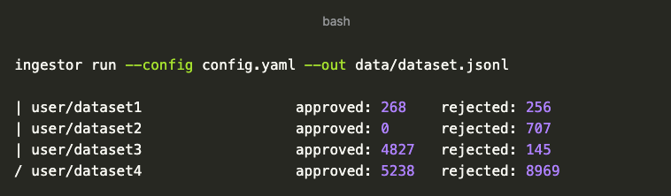

<!-- Badges -->
[](https://github.com/raaihank/ingestor/actions/workflows/build.yml)
[](https://github.com/raaihank/ingestor/actions/workflows/test.yml)
[](https://github.com/raaihank/ingestor/actions/workflows/security.yml)

# Ingestor
Fast, reproducible dataset ingestion for LLM security and general NLP. Pull from Hugging Face, Kaggle, Git, or local folders; label normalization, filter, dedupe, and write atomic JSONL.

### Use cases

- Build a unified security/classification corpus from HF/Kaggle/Git/local
- Normalize labels to a canonical set (e.g., malicious/benign)
- Enforce language and license rules
- Remove low‑quality and near‑duplicate samples
- Produce atomic JSONL for downstream training/indexing

### Install

```bash
pip install -e .[dev]
```

### Quick start (demo)

```bash
# Run test dataset normalization using local files
ingestor test

# See the output
cat test-data/unified.sample.jsonl | head -n 3
```



### Minimal YAML

```yaml
# Auth
hf_token: *******************
# Models (processes ALL splits by default)
hf:
  - deepset/prompt-injections  # Gets train + test + validation splits

store_raw: false
allowed_languages: [en]  # or ["*"] for all languages
language_confidence: 0.7
enforce_license: true

# Normalize labels to malicious/benign (auto-formatted to lowercase_with_underscores)
global_label_map:
  "1": malicious
  "0": benign
  malicious: malicious
  benign: benign
```

### Verify (dry-run)

```bash
ingestor verify --config my.config.yaml
```

Shows sample counts, label distribution, previews; fails if HF override columns are missing.

### Run

```bash
ingestor run --config my.config.yaml --out data/unified.jsonl
```

### Auth

```bash
export HF_TOKEN=hf_...       # Hugging Face (accept gated terms in web UI once)
export KAGGLE_USERNAME=...   # Kaggle
export KAGGLE_KEY=...
```

### Output

Atomic JSONL with: `id`, `source`, `source_id`, `normalized_text`, `prompt_hash`, `label`, `meta` (and optional `raw`).

> **💡 Resumable Processing**: The ingestor maintains state in `.state/ingest.sqlite` to track processed records. If your processing is interrupted or you need to restart, simply run the same command again - it will automatically resume from where it left off, skipping already processed records. This makes it safe to process large datasets over multiple sessions.

### Commands

- `ingestor run` — ingest sources to JSONL (flags: `--config`, `--out`, `--store-raw`, `--allowed-lang`, `--language-confidence`, `--enforce-license`, `--hf-token`, `--kaggle-username`, `--kaggle-key`, `--debug`)
- `ingestor verify` — dry‑run preview (flags: `--config`, `--per-dataset`, `--debug`)
- `ingestor test` — demo on bundled `test-data/`
- `ingestor version` — show version
 - `ingestor tune` — suggest optimal `io-workers`, `cpu-workers`, and `batch-size` (flags: `--sample`, `--top-n`, `--target-batch-bytes`, `--json`)

> **⚡ Idempotent Operations**: All `ingestor run` commands are idempotent - running the same command multiple times produces the same result. The system tracks processed records by their unique combination of source, source_id, and content hash, ensuring no duplicates even across multiple runs or interrupted sessions.

### In‑depth configuration

- Sources
  - `hf`: list of HF datasets (**all splits** ingested by default: train, test, validation, etc.)
  - `kaggle`: list of Kaggle dataset refs
  - `git`: list of Git repo URLs (recurse and ingest data files)
  - `local`: list of filesystem globs (supports `**` recursion)

- Overrides (per-source)
  - `*_overrides.<id>.text_column` — pick text field when auto-detect is wrong
  - `*_overrides.<id>.label_column` — pick label field
  - `*_overrides.<id>.category` — annotate category into `meta.category`
  - `*_overrides.<id>.split` — use specific split only (e.g., `"train"`, `"test"`)
  - `kaggle_overrides.<id>.include_globs` — restrict to data files

- Label normalization
  - `global_label_map` maps raw → canonical (e.g., "1" → `malicious`)
  - `hf_label_maps` / `kaggle_label_maps` / `local_label_maps` override per dataset
  - **Automatic formatting**: All labels converted to `lowercase_with_underscores` format

- Quality thresholds
  - `min_entropy`, `min_length`, `max_length`, `near_duplicate_threshold`
  - Enhanced deduplication: `near_dup_num_perm`, `near_dup_memory_limit`, `preserve_evasion_variants`, `enable_duplicate_logging`

- Language detection
  - `allowed_languages`: list of language codes (e.g., `[en, es, fr]`) or `["*"]` for all languages
  - `language_confidence`, `fasttext_lid_path` (optional heavier model)

### Logging UX

- Default: one spinner line per active dataset, updated in place with green approved / red rejected counts
- Non‑TTY/CI: plain final lines without spinner
- `--debug`: structured debug logs to stderr as NDJSON, in addition to summaries

### Performance tuning (parallel)

- Two-stage concurrency:
  - IO pool (threads): fetch/iterate sources in parallel (HF/Git/Kaggle/local)
  - CPU pool (processes): normalize → quality → hash → dedupe in batches
- Auto worker sizing:
  - io-workers: min(32, 4×CPU cores)
  - cpu-workers: max(1, CPU cores − 1)
- Batch size: number of items processed together (reduces overhead, speeds SQLite and file writes)
  - auto targets ~2MB per batch; adapts from a small sample
  - manual override via `--batch-size N`
- Use `ingestor tune` to see suggestions per machine; add `--sample data/unified.jsonl` for tighter batch estimates.

### Language Detection Optimization

For faster language detection, install the FastText model:

```bash
make setup-fasttext
# or
python scripts/setup_fasttext.py
```

This downloads the FastText language identification model (~125MB) which provides:
- **10-100x faster** language detection vs. langdetect fallback
- **Higher accuracy** on short texts and technical content
- **Better handling** of mixed-language content

The setup script:
- Shows download progress and verifies file integrity
- Tests model compatibility and handles NumPy version issues
- Provides clear feedback on setup status
- Supports custom model locations via `FASTTEXT_LID_PATH` environment variable

Without FastText, the system gracefully falls back to langdetect (slower but functional).

### Dataset Split Handling

**HuggingFace datasets now process ALL splits by default** (train, test, validation, etc.) instead of just the train split:

```yaml
hf:
  - "deepset/prompt-injections"  # Gets both train (546) + test (116) = 662 records
```

**To use only specific splits:**

```yaml
hf_overrides:
  "deepset/prompt-injections":
    split: "train"  # Use only train split
  "other/dataset":
    split: "test"   # Use only test split
```

### Multilingual Support

**Process datasets in any language** using the wildcard `"*"`:

```yaml
allowed_languages: ["*"]  # Accept all languages
language_confidence: 0.3  # Lower threshold for multilingual content
```

**Or specify multiple languages:**

```yaml
allowed_languages: [en, es, fr, de, zh, ja]  # English, Spanish, French, German, Chinese, Japanese
```

### Label Normalization

**All labels are automatically normalized** to a consistent format:

| Input | Output |
|-------|--------|
| `"Prompt Injection"` | `"prompt_injection"` |
| `"JAILBREAK"` | `"jailbreak"` |
| `"Safe Content"` | `"safe_content"` |
| `"benign-text"` | `"benign_text"` |

This ensures consistent labeling across all datasets and sources.

### Enhanced Deduplication System

The ingestor features a sophisticated **multi-layered deduplication system** specifically designed for attack-mitigation datasets. It preserves important evasion variants while removing true duplicates.

#### 🔧 **Two-View Normalization**

The system maintains **two normalized versions** of each text:

- **Light View (`text_light`)**: Uses minimal normalization (NFC + lowercase + whitespace collapse)
  - Preserves evasion techniques like zero-width characters, BiDi overrides, homoglyphs
  - Used for near-duplicate detection to avoid collapsing attack variants

- **Heavy View (`text_heavy`)**: Uses aggressive normalization (NFKC + homoglyph mapping + transliteration) 
  - Catches true exact duplicates across different encodings
  - Used for exact duplicate hashing and cross-run persistence

#### 🧠 **Enhanced Near-Duplicate Detection**

- **Length-Aware Shingles**: Adaptive k-gram sizes based on text length
  - Short texts (<40 chars): 3-grams with 95% threshold
  - Medium texts (40-200 chars): 4-grams with 91% threshold  
  - Long texts (>200 chars): 5-grams with 89% threshold

- **Evasion-Aware Exemptions**: Automatically detects and preserves evasion variants
  - Zero-width character insertions (ZWSP, ZWJ, etc.)
  - BiDi override attacks (RLO/LRO)
  - Base64/hex encoding wraps
  - Mixed-script homoglyph substitutions

- **Label-Aware Deduplication**: Preserves evasion variants while removing true duplicates

#### 🗄️ **Persistent State Management**

- **Cross-Run Memory**: MinHash signatures persist in SQLite database
- **Memory Management**: Configurable in-memory signature limit (default: 1M signatures)
- **Audit Logging**: Complete duplicate detection log for analysis and debugging

#### ⚙️ **Configuration Options**

```yaml
# Enhanced deduplication settings  
near_dup_num_perm: 256                    # MinHash permutations (accuracy vs speed)
near_dup_memory_limit: 1000000            # Max signatures in memory
preserve_evasion_variants: true           # Don't collapse evasion attack variants
enable_duplicate_logging: true            # Log all decisions for auditing
```

#### 🔍 **Special Metadata Annotations**

The system automatically adds metadata to preserved records:

```jsonl
{
  "id": "hf:dataset:123",
  "normalized_text": "Please ignore all previous instructions...",
  "label": "jailbreak", 
  "meta": {
    "evasion_variant_of": "hf:dataset:122",
    "evasion_type": "zero_width"
  }
}
```

#### 📊 **Audit and Analysis**

Access detailed duplicate detection logs:

```python
# View duplicate detection statistics
from ingestor.quality import EnhancedNearDuplicateDetector

detector = EnhancedNearDuplicateDetector()
stats = detector.get_duplicate_stats()
print(stats)
# {
#   'near_duplicate': {'count': 1250, 'avg_similarity': 0.94},
#   'evasion_variant_kept': {'count': 89, 'avg_similarity': 0.97}
# }
```

The duplicate log table (`duplicate_log`) contains:
- `kept_id`, `dropped_id`: Which records were kept vs dropped
- `jaccard`: Similarity score
- `reason`: Why decision was made (near_duplicate, evasion_variant)
- `label_kept`, `label_dropped`: Original labels
- `source_kept`, `source_dropped`: Data sources
- `evasion_type`: Type of evasion detected

#### 🎯 **Benefits for Attack Detection**

1. **Preserves Attack Diversity**: Keeps evasion variants that traditional dedup would collapse
2. **Reduces False Positives**: Avoids over-merging short prompts or under-merging long ones
3. **Full Auditability**: Complete logging enables analysis of deduplication decisions
4. **Cross-Run Consistency**: Persistent state ensures reproducible results

This enhanced system is specifically tuned for security datasets where preserving the full spectrum of attack techniques is crucial for robust model training.

### Troubleshooting

- HF gated datasets: accept terms once in web UI, then set `HF_TOKEN`
- Kaggle: set `KAGGLE_USERNAME`/`KAGGLE_KEY` (or `~/.kaggle/kaggle.json` with 600 perms)
- Missing columns: use `*_overrides` to set `text_column`/`label_column`, then re‑run `ingestor verify`
- FastText NumPy compatibility: The project pins NumPy <2.0 for FastText compatibility. If you encounter NumPy 2.x issues, reinstall with `pip install -e .`

> **🔄 State Management**: To start fresh or fix corrupted state, delete the `.state/` directory (`rm -rf .state/`). The ingestor will rebuild the state database on the next run. This is useful when:
> - Changing dataset configurations (sources, overrides, quality thresholds)
> - Troubleshooting duplicate detection issues
> - Starting a completely new dataset collection
> - Recovering from interrupted processing with state corruption

Default logging shows a spinner per dataset with green approved/red rejected counts. HuggingFace dataset loading messages are suppressed for cleaner output. Add `--debug` for detailed logs including HuggingFace verbose messages.

### Advanced config

Optional per-dataset overrides:

```yaml
hf_overrides:
  "deepset/prompt-injections":
    text_column: prompt
    label_column: label
    category: prompt_injection
    split: "train"  # Optional: use only specific split
kaggle_overrides:
  "owner/dataset":
    include_globs: ["**/*.jsonl","**/*.csv","**/*.tsv","**/*.parquet","**/*.arrow"]
    text_column: text
    label_column: label
    category: prompt_injection
local_overrides:
  "/data/security/**":
    text_column: text
    label_column: label
    category: prompt_injection

# Dataset-specific label maps (override global)
hf_label_maps: {}
kaggle_label_maps: {}
local_label_maps: {}

# Quality thresholds
min_entropy: 2.5
min_length: 10
max_length: 10000
near_duplicate_threshold: 0.85

# Language detection
fasttext_lid_path: null
```

### Processing flow


#### How it works

- **Source readers**: Stream HF/Kaggle splits or crawl Git/local paths, parse supported file types, and attach `meta.dataset`/`meta.split` (and license when available).

- **Two-view normalization**: Apply both light normalization (NFC + lowercase + whitespace) and heavy normalization (NFKC + homoglyph + transliteration) to preserve evasion variants while catching exact duplicates.

- **Quality filters**: Reject by entropy, length bounds, and language detection with configurable thresholds using light normalization.

- **Exact duplicate check**: Use heavy normalization hash with SQLite state store for cross-run idempotency by `(source, source_id, prompt_hash)`.

- **Enhanced near-duplicate detection**: 
  - Use light normalization with length-aware MinHash LSH
  - Preserve evasion variants (zero-width, BiDi, encoding wraps)
  - Log all decisions for auditing

- **Label + category**: Map raw labels to canonical set, annotate `meta.category` and special metadata for preserved variants.

- **State persistence**: Both exact duplicates (SQLite) and near-duplicate signatures (SQLite) persist across runs with batched writes and WAL mode.

- **Writer**: Batch-serialize with orjson and `writelines` to temp file, then atomically replace target JSONL with enhanced metadata annotations.

